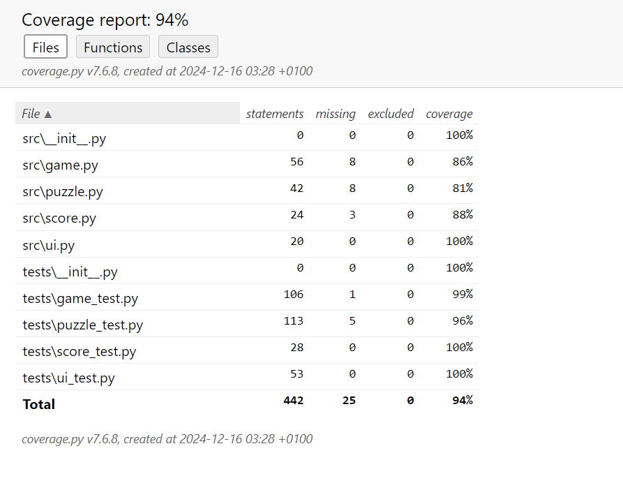

# Puzzle Master: A Test-Driven Development Project

## Course Information
- **Course:** 1DV609 -  Software Testing
- **Institution:** Linnaeus University
- **Project Type:** Test-Driven Development (TDD) Implementation

## Project Team
- **Nabil Al-Harethi**
- **Andrey Belozerov**

## Project Overview

### Puzzle Master: A Multi-Level Puzzle Learning Game

Puzzle Master is an educational puzzle game that challenges players with a variety of puzzles across different domains: Mathematics, Word Games, and Logic Puzzles. The game is designed to demonstrate the principles of Test-Driven Development (TDD) and software design best practices.

## Game Concept

Players progress through levels by solving puzzles of increasing complexity:
- **Puzzle Types**:
  1. Mathematical Challenges
  2. Word Puzzles
  3. Logical Reasoning Problems

- **Game Mechanics**:
  - Multiple difficulty levels
  - Scoring system
  - Progressive level advancement
  - Dynamic puzzle generation

## Test-Driven Development (TDD) Approach

This project strictly adheres to the TDD workflow:

### TDD Cycle Stages
- **Red**: Write a failing test
- **Green**: Implement minimal code to pass the test
- **Refactor**: Improve code design without changing behavior

---

**Note**: This project is a demonstration of Test-Driven Development principles and is part of an academic course assignment.

## Installation

Clone the repository:

git clone https://github.com/yourusername/puzzle-challenge.git

cd puzzle-challenge

## Running the Game

python -m src.main

## Running Tests

pytest

## How to Play

Choose a difficulty level (1-3)

Solve puzzles across Math, Words, and Logic categories

You have 3 lives

Each correct answer gives you 10 points

Incorrect answers reduce your lives

## Game Rules

Select difficulty: 1 (Easy), 2 (Medium), 3 (Hard)

Time limits vary by difficulty

Unique puzzles in each game session

Game ends when you run out of lives or complete all 
puzzles

## Code Coverage

Our current test suite achieves **94% code coverage** across the project. 

### Coverage Breakdown:

### Why Not 100% Coverage?

The slight gaps in coverage for `game.py`, `puzzle.py`, and `score.py` is due  a few  edge cases that haven't been fully tested.  such as Specific input combinations not covered by the current test suite like A user entering unusual or unexpected inputs or Scenarios where certain features or methods interact in non-standard ways.

and Rare error handling paths that are difficult to trigger in unit tests like Invalid configurations or corrupted data.
Rare runtime errors (e.g., empty puzzle lists, invalid difficulty levels).
